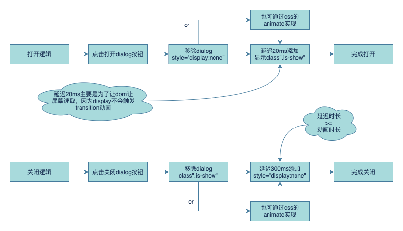
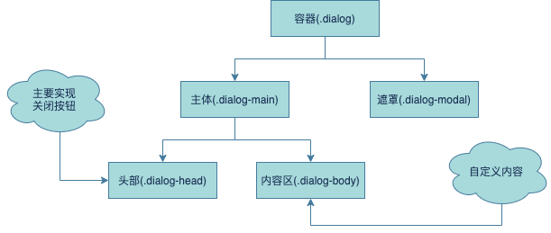

## 基本逻辑


## HTML结构


## CSS
### dialog容器(.dialog)：  
使用fixed定位萝莉文档流，并且将z-index设置较大的值，这样包含在里面的元素就能保证处于其他页面顶层。  

### dialog遮罩(.dialog-modal)：  
使用absolute绝对定位脱离了文档流，但是他是相对于dialog容器中定位的，所以我们存在平级的dialog主体(.dialog-main)是相互不干扰的。  

### dialog主体(.dialog-main)：  
外层两个容器都是脱离了文档流，所以处于顶层，触发的事件也不会穿透到容器和遮罩。

## 动画
打开  
dialog主体：  
opacity：0 -> 1 | transform：Y：10% -> 0

关闭  
dialog主体：  
opacity：1 -> 0 | transform：Y：0 -> 10%
> 特别地，display: none不是动画也不会触发动画，可查看文末相关链接。

## JS
为打开/关闭按钮/Modal注册click事件，给容器增删样式并通过setAttribute和removeAttribute设置style属性。要注意的是Modal的点击要停止冒泡，放置其他自定义元素写了css脱离文档流的dom误触。
> 计时器使用完一定要记得清除！！！虽然浏览器会自动回收资源但是如果反复多次点击执行了多个定时器就会造成定时器的timer越来越短，会导致动画执行失败。

## 响应式
响应式主要的原理是`媒体查询`
```css
@media screen and (min-width: 768px) {}
```
以上代码通过查询screen，监听width属性，根据不同尺寸执行不同的css样式（合并），需要注意的是媒体查询也是有权重的。

## 有趣的知识点
display(none)：https://developer.mozilla.org/zh-CN/docs/Web/CSS/display#display_none  
place-items：https://developer.mozilla.org/zh-CN/docs/Web/CSS/place-items  
position：https://developer.mozilla.org/zh-CN/docs/Web/CSS/position  
setTimeout：https://developer.mozilla.org/zh-CN/docs/Web/API/setTimeout  
媒体查询：https://developer.mozilla.org/zh-CN/docs/Web/CSS/@media